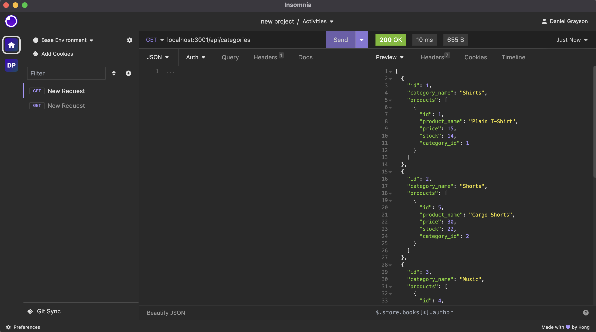
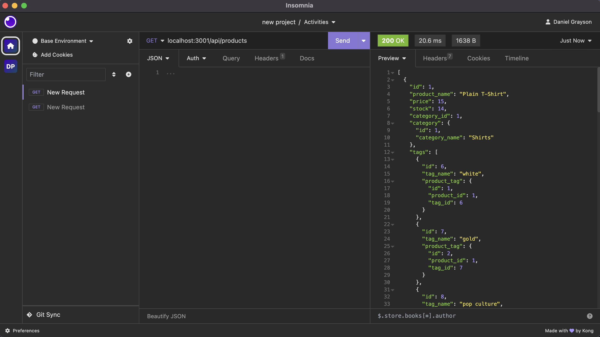
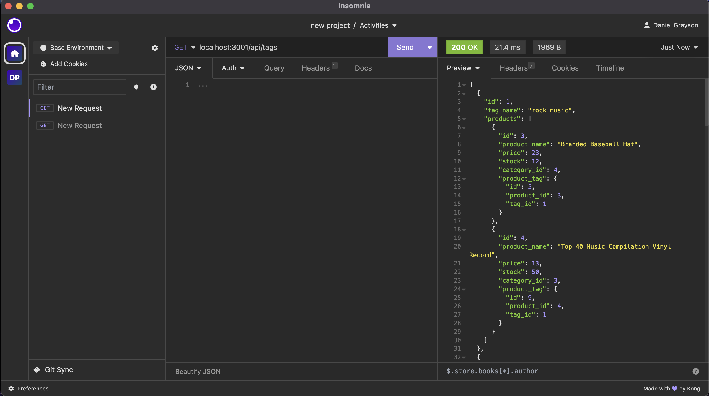

# E-comm_Challenge

This challenge is for the back-end for an e-sommerce clothing site.

The site is built upon using Express.js and configuring it with 
sequelize on the back-end to interact with the database. This database 
utilizes api routes from the tables and uses CRUD operations to 
modify the data.

# Installation

1. Clone the Repo from https://github.com/GrayCoded/E-comm_Challenge
2. Once cloned open through the terminal directory
3. Run npm install to install the dependecies
4. Create a .env file to secure your database info (database name, username, and password)

# Usage

1.Open your MySql Shell to create the database.
2.Run npm run seed to populate table.
3.Run npm start to initiate the server.

# Walkthrough

In this video https://drive.google.com/file/d/1Bx-CeXyLWYUs-5eXPa2vXifaOf0Llbci/view it demostrates how to use the application.

# Technologies Used

Express.js
Sequelize
dontenv
mysql

# License

MIT license is in use. Note that this is based on a built software provided
from class material and samples.